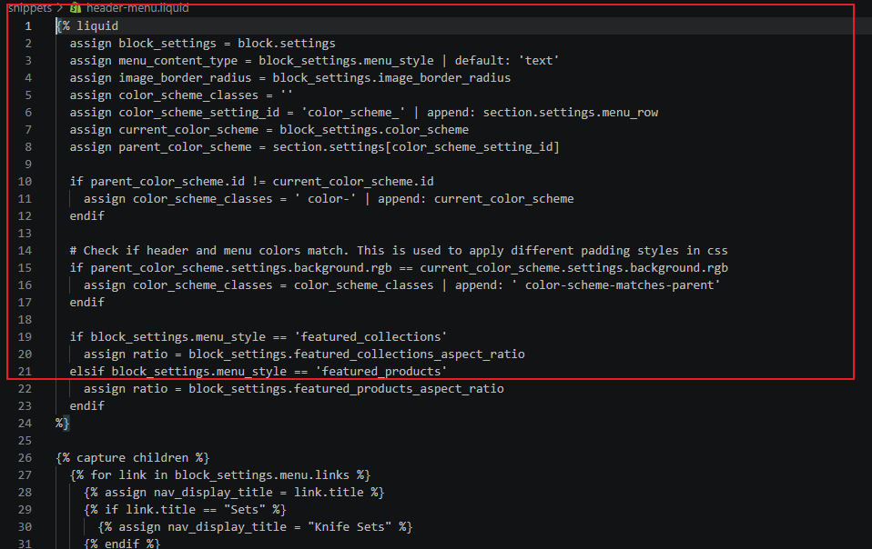
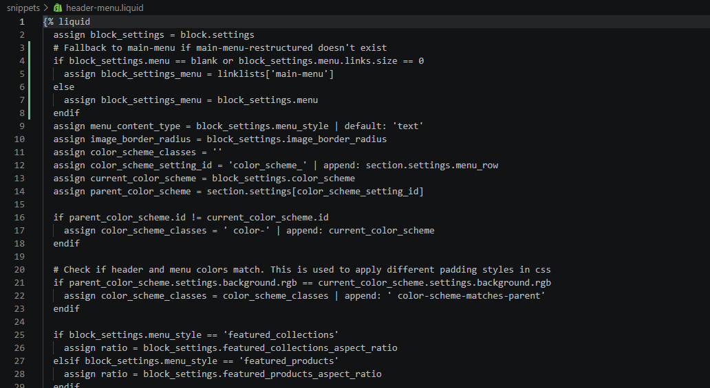

# What I picked

The header was completely broken on the dev store. No navigation, no working icons. i picked this because it's the first thing any visitor sees and it was just... not there. A store with no nav and broken icons doesn't convert. That felt like the highest impact thing to fix.

---

## Why it's the highest-impact thing here

If someone lands on the homepage and the header is empty, they can't go anywhere. The cart icon was broken, the search icon was broken, and the entire menu was invisible. Everything else on the site could be perfect and it wouldn't matter. i wanted to fix the thing that was stopping the store from functioning at all.

---

## What I did

**Fix 1 — Broken cart and search icons**

The original inline SVG code had been commented out and replaced with `` tags pointing to files that don't exist in the theme assets (`ShoppingCartSimple.svg`, `MagnifyingGlass.svg`). So the icons were just broken image placeholders.

i removed the img tags and uncommented the original inline SVG lines.

Files changed: `snippets/cart-icon-component.liquid`, `snippets/search.liquid`

---

**Fix 2 — Navigation menu not rendering**

The header was looking for a menu with the handle `main-menu-restructured` which doesn't exist on the dev store. So the loop had nothing to iterate over and rendered nothing.

i added a Liquid fallback — if that menu is blank or has no links, fall back to `main-menu`. The nav shows up perfectly now.

File changed: `sections/header-menu.liquid`

---

**Fix 3 — Debug console.log left in production**

There was a `console.log(event)` sitting inside the `handleSubmit()` method in `product-form.js`. It fires every single time someone clicks add to cart. Not a crash, but it's the kind of thing that tells you the code wasn't tested before it went live.

i deleted the line.

File changed: `assets/product-form.js`

---

## What I'd do next

i'd look at the bundle builder page next. It's a dead page right now and it's literally linked in the nav. After that i'd run Lighthouse on the homepage because i noticed a few render-blocking scripts that looked easy to fix.